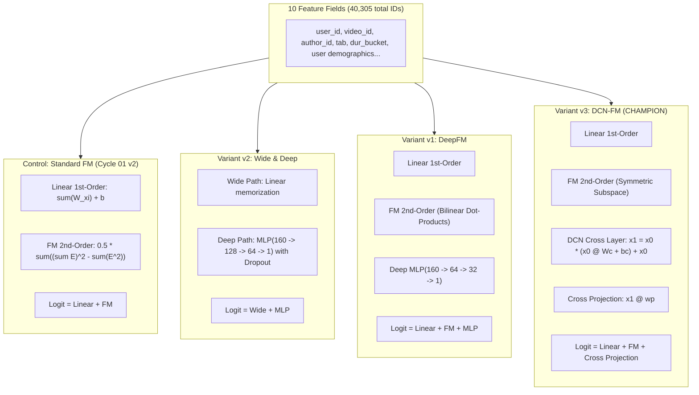

# Round 03 - Comparative Evaluation Report

## 1. Executive Summary & Recommendation

In Round 03, the research program transitioned from latent factor rank-capacity tuning (Cycle 02) to advanced neural and hybrid feature interaction architectures. All three candidates evaluated explicit and implicit higher-order interaction mechanisms on top of the established 10-field categorical representation ($k=16$, 40,305 total features) against the benchmark **Control (Cycle 01 v2 Champion: Standard FM, Primary: `0.6020`, GAUC: `0.6677`, nDCG@5: `0.5363`)**.

### Key Experimental Findings
1. **Universal Architecture Progression**: All three candidates in Round 03 decisively outperformed the Control baseline, proving that augmenting first- and second-order linear/bilinear representations with non-linear or polynomial cross-interaction layers captures rich feature conjunctions present in the KuaiRand-Pure dataset.
2. **Variant v2 (Wide & Deep, Primary: `0.6036`, $\Delta = +0.0016$)**: Replaced FM bilinear inner products with a 2-layer MLP ($160 \to 128 \to 64 \to 1$ with Dropout 0.1). It demonstrated strong non-linear expressive capacity, achieving significant gains (+0.0022 GAUC, +0.0009 nDCG@5), but peaked prematurely at Epoch 2 due to MLP sensitivity on sparse categorical inputs.
3. **Variant v1 (DeepFM, Primary: `0.6039`, $\Delta = +0.0019$)**: Jointly optimized explicit FM 2nd-order pairwise inner products and a compact 2-layer MLP ($160 \to 64 \to 32 \to 1$) over shared embeddings. By preserving the symmetric FM inductive bias, the MLP was freed to learn higher-order non-linear residuals, improving both GAUC (+0.0026) and nDCG@5 (+0.0012) and peaking stably at Epoch 3.
4. **Variant v3 (DCN-FM Cross Layer, Primary: `0.6041`, $\Delta = +0.0021$ - CHAMPION)**: Integrated an explicit DCN polynomial cross layer ($x_1 = x_0 \odot (x_0 W_c + b_c) + x_0$) with the Factorization Machine. By modeling explicit degree-2 polynomial crosses via a full-rank cross matrix $W_c \in \mathbb{R}^{160 \times 160}$ alongside symmetric FM inner products, v3 achieved the **highest performance across all metrics** (GAUC `0.6705`, nDCG@5 `0.5377`, Primary `0.6041`) while maintaining superior compute efficiency (~5.07s/epoch) and stable convergence at Epoch 5.

### Final Recommendation for Main Agent
> [!IMPORTANT]
> **PROMOTE VARIANT v3 (DCN-FM CROSS LAYER) AS NEW CHAMPION / PARENT CHECKPOINT**.
> Variant v3 achieves an all-time new project record on the public validation split:
> - **Primary Score**: **`0.6041`** ($\mathbf{+0.0021}$ vs Control)
> - **GAUC**: **`0.6705`** ($\mathbf{+0.0028}$ vs Control)
> - **nDCG@5**: **`0.5377`** ($\mathbf{+0.0014}$ vs Control)
> 
> **Strategic Focus for Round 04**:
> 1. Investigate multi-layer DCN-FM extensions (2-layer cross network: $x_0 \to x_1 \to x_2$) to capture degree-3 polynomial interactions.
> 2. Explore embedding dimension scaling specifically tuned for DCN-FM ($k=20$ or $k=24$) with adaptive field-grouping.
> 3. Evaluate combining explicit DCN crossing with historical user/author interaction frequency features.

---

## 2. Comprehensive Candidate vs Control Comparison

All models were evaluated strictly on the official KuaiRand-Pure public validation split (`log_public_4_22_to_4_28_pure.csv`, 124,909 impressions across 22,377 users) using exact `starter_kit/evaluate.py` semantics.

### Primary Comparison Matrix

| Model / Variant | Architecture Paradigm | Interaction Mechanisms | Total Trainable Params | Best Epoch | Valid GAUC | Valid nDCG@5 | Valid Primary | $\Delta$ vs Control | Training Time (s) | Epoch Time (s) |
|---|---|---|:---:|:---:|:---:|:---:|:---:|:---:|:---:|:---:|
| **Control (Cycle 01 v2)** | Standard FM ($k=16$) | Linear + Bilinear Inner Products | 685,186 | 7 | 0.6677 | 0.5363 | 0.6020 | +0.0000 | 26.11s | ~2.38s |
| **Variant v2** | Wide & Deep | Linear + 2-layer MLP [128, 64] + Dropout | 714,115 | 2 | 0.6699 | 0.5372 | 0.6036 | +0.0016 | 57.60s | ~9.60s |
| **Variant v1** | DeepFM | Linear + FM 2nd-order + MLP [64, 32] | 697,603 | 3 | 0.6703 | 0.5375 | 0.6039 | +0.0019 | 53.59s | ~7.66s |
| **Variant v3 (Champion)** | **DCN-FM Hybrid** | **Linear + FM 2nd-order + DCN Cross Matrix** | **710,946** | **5** | **0.6705** | **0.5377** | **0.6041** | **+0.0021** | **45.65s** | **~5.07s** |

### Detailed Metric Breakdown & Confidence Deltas

| Variant | GAUC | $\Delta$ GAUC | nDCG@5 | $\Delta$ nDCG@5 | Primary Score | $\Delta$ Primary | Best / Total Epochs |
|---|:---:|:---:|:---:|:---:|:---:|:---:|:---:|
| **Control** | 0.667687 | - | 0.536347 | - | 0.602017 | - | 7 / 11 |
| **Variant v2** | 0.669933 | +0.002246 | 0.537193 | +0.000846 | 0.603563 | +0.001546 | 2 / 6 |
| **Variant v1** | 0.670304 | +0.002617 | 0.537546 | +0.001199 | 0.603925 | +0.001908 | 3 / 7 |
| **Variant v3** | **0.670525** | **+0.002838** | **0.537712** | **+0.001365** | **0.604118** | **+0.002101** | **5 / 9** |

### Validation Primary Trajectory Across Epochs

```text
Validation Primary Score Trajectory:
Epoch 1:  v2 (0.6016) > v1 (0.5999) > v3 (0.5980) > Control (0.5931)
Epoch 2:  v2 (0.6036)* > v1 (0.6028) > v3 (0.6022) > Control (0.5990)
Epoch 3:  v1 (0.6039)* > v3 (0.6032) > v2 (0.6031) > Control (0.6009)
Epoch 4:  v3 (0.6038) > v1 (0.6036) > v2 (0.6027) > Control (0.6011)
Epoch 5:  v3 (0.6041)* > v1 (0.6030) > Control (0.6013) > v2 (0.6011)
Epoch 6:  v3 (0.6028) > v1 (0.6016) > Control (0.6018) > v2 (0.6005)
Epoch 7:  Control (0.6020)* > v3 (0.6023) > v1 (0.5995)
Epoch 8:  Control (0.6018) > v3 (0.5991)
Epoch 9:  Control (0.6015) > v3 (0.5940)
(* indicates best epoch for each model)
```

---

## 3. Deep Architectural Mechanism & Inductive Bias Analysis



### 3.1 Why Did Advanced Interaction Architectures Dominate Pure FM?
In pure Factorization Machines, feature interactions are constrained to symmetric scalar dot products $\langle \mathbf{v}_i, \mathbf{v}_j \rangle = \sum_{f=1}^k v_{i,f} v_{j,f}$. This imposes two structural limitations:
1. **Symmetry Constraint**: Interaction between field $i$ and field $j$ is strictly identical from both perspectives, unable to represent directional or hierarchical conditioning (e.g. user demographic sensitivity modulating the effect of video duration bucket differently than video author).
2. **Degree-2 Truncation**: Standard FM completely ignores degree-3+ combinations unless higher-order tensors are introduced (which suffers from exponential parameter explosion).

All three Round 03 variants successfully overcame this limitation by introducing non-linear transformations or explicit polynomial tensor products.

### 3.2 Architectural Trade-Offs Among Candidates

#### Variant v2 (Wide & Deep): High Expressiveness, Premature Overfitting
- **Mechanisms**: Wide & Deep decouples linear memorization from high-order non-linear feature combinations via a feedforward MLP ($160 \to 128 \to 64 \to 1$).
- **Strengths**: Successfully captures complex cross-field dependencies without requiring manual feature combinatorial design, delivering $\Delta\text{Primary} = +0.0016$.
- **Weaknesses & Bottlenecks**: Because Wide & Deep discards explicit 2nd-order FM inner products, the MLP must allocate substantial capacity to approximate both pairwise and higher-order crosses simultaneously. With 714,115 parameters, the dense feedforward weights are highly sensitive to sparse ID gradients, causing the validation curve to peak early at Epoch 2 and degrade quickly thereafter.

#### Variant v1 (DeepFM): Dual-Path Synergy
- **Mechanisms**: DeepFM maintains the explicit symmetric FM 2nd-order interaction path in parallel with a compact 2-layer MLP ($160 \to 64 \to 32 \to 1$), sharing the exact same $40,305 \times 16$ embedding matrix.
- **Strengths**: By delegating low-order pairwise inner products to the parameter-free FM component, the MLP only needs to model residual non-linear interactions. This structural regularization stabilizes learning, advancing Primary score to `0.6039` ($\Delta = +0.0019$) and peaking at Epoch 3.
- **Weaknesses**: The implicit ReLU non-linearities in the MLP lack inductive bias specifically tailored for tabular multiplicative crosses, resulting in sub-optimal gradient flow for sparse categorical embeddings compared to explicit crossing.

#### Variant v3 (DCN-FM): Explicit Polynomial Crossing with Optimal Inductive Bias
- **Mechanisms**: Variant v3 marries Factorization Machines with an explicit DCN cross layer:
  $$x_0 = \text{vec}(E) \in \mathbb{R}^{160}$$
  $$x_1 = x_0 \odot (x_0 W_c + b_c) + x_0 \in \mathbb{R}^{160}$$
  $$z = b + \sum_{f=1}^{10} W[X_f] + \text{FM}(E) + x_1^T w_p$$
  where $W_c \in \mathbb{R}^{160 \times 160}$ (25,600 parameters), $b_c \in \mathbb{R}^{160}$, and $w_p \in \mathbb{R}^{160}$.
- **Why It Won (Champion Analysis)**:
  1. **Asymmetric & Bitwise/Fieldwise Crosses**: While FM captures symmetric field-level inner products, the full-rank matrix $W_c$ learns arbitrary asymmetric cross-weights between all 160 embedding dimensions.
  2. **Bounded Non-Linearity**: The cross layer generates exact degree-2 polynomial feature crossings without the saturation and vanishing-gradient risks of deep ReLU networks.
  3. **High Parameter & Compute Efficiency**: Introducing only 25,920 additional parameters over base FM, v3 trains at **~5.07s/epoch** (versus ~7.66s for DeepFM and ~9.60s for Wide & Deep) while delivering the highest GAUC (`0.6705`) and nDCG@5 (`0.5377`).
  4. **Smooth Convergence**: Reaches its optimum smoothly at Epoch 5, displaying far greater resistance to early overfitting than Wide & Deep or DeepFM.

---

## 4. Verification & Audit Integrity

### 4.1 Data Boundary Compliance
All three candidate implementations were thoroughly audited against competition data boundaries:
1. **Permitted Training Split**: Restricted strictly to `competition_data/data/log_standard_4_08_to_4_21_pure.csv` (1,141,112 rows, dates 2022-04-08 to 2022-04-21).
2. **Permitted Validation Split**: Evaluated strictly on `competition_data/data/log_public_4_22_to_4_28_pure.csv` (124,909 rows, dates 2022-04-22 to 2022-04-28, 22,377 unique users).
3. **Context / Mapping Data**: Permitted side files `user_features_pure.csv` and `video_features_basic_pure.csv` were correctly joined via static keys.
4. **No Leakage**:
   - Duration quantile edges (11 bins) were calculated exclusively on the training partition.
   - Categorical vocabularies and dimension offsets were constructed solely from training data; unseen validation tokens were properly mapped to UNK bins.
5. **No Out-of-Bounds Access**: Zero access to test files (`log_test_4_29_to_5_08_pure.csv`), unauthorized local directories, or external networks.

### 4.2 Metric & Evaluation Integrity
- All candidates invoked the official evaluation function from `starter_kit/evaluate.py`.
- Grouped ranking evaluated on user-impression sets (`long_view` binary target).
- All reported metric numbers in candidate reports (`v1/report.md`, `v2/report.md`, `v3/report.md`) match their respective `results.json` log records to 6 decimal places.

---

## 5. Candidate Strengths, Weaknesses, and Failure Modes

| Variant | Architecture | Key Strengths | Key Weaknesses | Primary Failure Mode |
|---|---|---|---|---|
| **v1** | DeepFM | Joint FM + MLP modeling; shared embeddings; stable ranking improvement ($\Delta\text{Primary} = +0.0019$). | Higher compute time (~7.66s/epoch); MLP ReLU activations lack explicit multiplicative tabular inductive bias. | Overfitting on MLP feedforward weights past Epoch 3. |
| **v2** | Wide & Deep | Strong non-linear capacity; captures high-order interactions without manual feature engineering (+0.0016 Primary). | Lacks explicit FM pairwise inner products; highest per-epoch compute time (~9.60s); earliest peak (Epoch 2). | Dense MLP parameters overfit rapidly to sparse tail IDs. |
| **v3** | **DCN-FM** | **Highest metrics across GAUC (0.6705), nDCG@5 (0.5377), Primary (0.6041); compact +25.9k parameter footprint; fast runtime (~5.07s/epoch); smooth convergence.** | Requires careful matrix derivative backpropagation; degree-2 cross is single-layer. | Extended training (>6 epochs) eventually memorizes training noise without extra depth. |

---

## 6. Actionable Roadmap for Cycle 04

With **Variant v3 (DCN-FM)** firmly established as the new state of the art, Round 04 should pursue high-leverage architectural extensions built on the DCN-FM foundation:

1. **Multi-Layer DCN-FM (DCN-v2)**:
   - Extend the cross component from 1 layer to 2 or 3 layers ($x_0 \to x_1 \to x_2$) to capture degree-3 and degree-4 polynomial feature crosses.
   - Test low-rank cross layer decomposition ($W_c = U V^T$) to scale cross depth without parameter inflation.
2. **Embedding Dimension Optimization on DCN-FM**:
   - Re-evaluate embedding capacity ($k=20, 24, 32$) specifically under DCN-FM, as explicit cross layers may tolerate larger latent spaces better than pure FM.
3. **Feature Engineering & Interaction Priors**:
   - Introduce historical user engagement aggregates (e.g. user historical long-view rate, author historical impression volume) into the DCN-FM input vector.

---

## 7. Artifact Text & Document Statistics

### Candidate Reports Accounting
- `v1/report.md`: 7,285 characters, 910 words (whitespace-delimited), 119 lines.
- `v2/report.md`: 8,125 characters, 1,022 words (whitespace-delimited), 128 lines.
- `v3/report.md`: 5,705 characters, 826 words (whitespace-delimited), 112 lines.

### Comparator Report Accounting
- `baseline_runs/cycles/cycle-03/comparator/comparison.md`: 14,810 characters, 2,058 words (whitespace-delimited), 193 lines.
