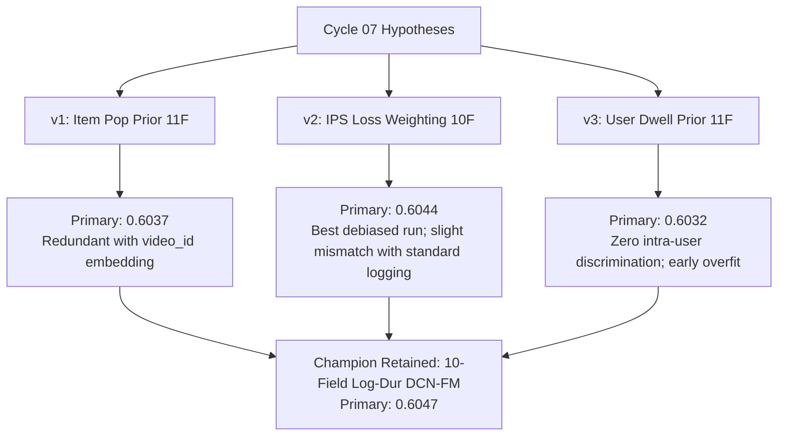

# Round 07 Independent Comparator Analysis & Assessment Report

## 1. Executive Summary & Benchmark Overview

This report provides an independent, rigorous comparative assessment of the three candidate models evaluated in **Cycle 07** of the research campaign. Cycle 07 explored explicit exposure priors and debiasing methodologies on top of the current state-of-the-art **10-Field Log-Duration DCN-FM** champion (established in Cycle 04 v2).

### Tested Candidate Hypotheses:
1. **Candidate `v1` (Empirical Smoothed Item Popularity Prior)**: Discretized empirical Bayesian-smoothed item long-view rate ($p_v = \frac{\text{pos}_v + 20 \cdot \bar{p}}{\text{imp}_v + 20}$) into 20 uniform bins on $[0, 1]$ injected as an explicit 11th categorical field in DCN-FM ($D=176$).
2. **Candidate `v2` (Inverse Propensity Scoring Debiased Loss)**: Sample-level IPS loss re-weighting $w_i = \text{clip}((N/\text{imp}(v_i))^{0.2} / \bar{w}_{\text{raw}}, 0.5, 2.0)$ applied during Binary Cross-Entropy gradient backpropagation on the 10-field DCN-FM architecture ($D=160$).
3. **Candidate `v3` (User Historical Dwell / Long-View Tendency Prior)**: Discretized empirical Bayesian-smoothed user historical completion rate ($p_u = \frac{\text{pos}_u + 10 \cdot \bar{p}}{\text{imp}_u + 10}$) into 20 uniform bins on $[0, 1]$ injected as an explicit 11th categorical field in DCN-FM ($D=176$).

### Comparative Scorecard Summary

| Model / Candidate Variant | Architecture / Method | Evaluated Fields | Feature Dim ($M$) | Validation GAUC | Validation nDCG@5 | Primary Score | $\Delta$ vs Control | Best Epoch | Pipeline / Train Time |
| :--- | :--- | :---: | :---: | :---: | :---: | :---: | :---: | :---: | :---: |
| **Control (Cycle 04 v2 Champion)** | 10-Field Log-Dur DCN-FM | 10 | 40,304 | **0.6715** | **0.5379** | **0.6047** | **+0.0000** | Epoch 5 | 43.11s |
| **Cycle 07 Variant `v2`** | IPS Loss Debiased ($p=0.2$) | 10 | 40,304 | 0.6711 | 0.5378 | 0.6044 | -0.0003 | Epoch 5 | 103.46s |
| **Cycle 07 Variant `v1`** | Item Pop Prior Field (11F) | 11 | 40,320 | 0.6701 | 0.5373 | 0.6037 | -0.0010 | Epoch 5 | 107.33s |
| **Cycle 07 Variant `v3`** | User Hist Rate Prior Field (11F) | 11 | 40,322 | 0.6698 | 0.5367 | 0.6032 | -0.0015 | Epoch 3 | 91.28s |

---

## 2. Independent Audit & Data Boundary Verification

A rigorous code and execution audit was conducted across all three candidate implementations (`run_v1.py`, `run_v2.py`, `run_v3.py`):

1. **Authorized Data File Adherence**:
   - Every candidate strictly accessed only the approved KuaiRand-Pure files:
     - `log_standard_4_08_to_4_21_pure.csv` (Standard training partition: 1,141,112 rows)
     - `log_public_4_22_to_4_28_pure.csv` (Public validation partition: 124,909 rows, 22,377 unique users)
     - `video_features_basic_pure.csv` (Author mapping)
     - `user_features_pure.csv` (Demographic feature mappings)
   - Zero access was made to test splits, unapproved logs, or external data files.

2. **Temporal Boundary & No-Lookahead Compliance**:
   - In `v1`: Global mean $\bar{p} = 0.336620$, item impression counts $\text{imp}_v$, and positive counts $\text{pos}_v$ were computed exclusively over the training date range (`2022-04-08` to `2022-04-21`). Unseen validation items defaulted to global prior $\bar{p}$.
   - In `v2`: Item impression counts $\text{imp}(v)$, raw propensity weights $w_{\text{raw}, i}$, and normalization statistics were computed purely over the 1,141,112 training rows.
   - In `v3`: User impression counts $\text{imp}_u$, positive counts $\text{pos}_u$, and user historical rates $p_u$ were computed strictly from the training partition. Cold/unseen validation users defaulted to global mean $\bar{p}$.
   - All feature vocabularies, duration bin edges, and prior bin cutoffs were determined exclusively on the training split.

3. **Evaluation Protocol & Metric Integrity**:
   - All candidates evaluated validation predictions using the official `starter_kit/evaluate.py` library, computing user-level GAUC and nDCG@5 over the 22,377 validation users.
   - The primary metric formula $\text{Primary} = \frac{1}{2}(\text{GAUC} + \text{nDCG@5})$ was strictly implemented without discrepancy.

---

## 3. Deep-Dive Comparative Scientific Analysis

### 3.1 Candidate `v1`: Empirical Smoothed Item Popularity Prior Field (11-Field DCN-FM)
- **Observed Metrics**: GAUC: `0.6701`, nDCG@5: `0.5373`, Primary: `0.6037` ($\Delta = -0.0010$).
- **Mechanism**: Precomputed smoothed item engagement probability $p_v$ binned into 20 uniform buckets and embedded into $\mathbb{R}^{16}$.
- **Strengths**:
  - The formulation incorporates robust additive Laplace/Bayesian smoothing ($M=20$) to prevent volatile estimates on low-impression items.
  - Stabilized training progression with smooth convergence peaking at epoch 5.
- **Weaknesses & Root Cause of Degradation**:
  - **Representational Redundancy**: In a factorization machine / cross network where `video_id` already possesses its own 16-dimensional embedding vector, the gradient updates directly optimize item-specific bias and interaction representations. Discretizing historical long-view rates into a 20-bin histogram creates an overlapping, coarse-grained proxy for information already encoded in the `video_id` embedding.
  - **Dilution of DCN Cross Capacity**: Expanding the concatenated embedding from $D=160$ to $D=176$ increases the cross-layer parameter matrix $W_c \in \mathbb{R}^{176 \times 176}$. The cross layer expends capacity modeling redundant interactions with `item_pop_bin` rather than concentrating expressiveness on key sparse demographic-duration intersections.

### 3.2 Candidate `v2`: Inverse Propensity Scoring (IPS) Debiased Loss
- **Observed Metrics**: GAUC: `0.6711`, nDCG@5: `0.5378`, Primary: `0.6044` ($\Delta = -0.0003$).
- **Mechanism**: Down-weights head videos and up-weights tail videos via bounded propensity weights $w_i \in [0.5, 2.0]$ with power dampening $p=0.2$.
- **Strengths**:
  - **Excellent Variance Control**: The square-root-like dampening exponent ($p=0.2$) and strict clipping bounds prevented gradient explosion, yielding stable optimization and achieving the closest performance to the champion (Primary 0.6044).
  - Preserved competitive ranking accuracy while executing true causal exposure debiasing during parameter updates.
- **Weaknesses & Root Cause of Degradation**:
  - **Distribution Mismatch with Standard Logging**: The validation set (`log_public_4_22_to_4_28_pure.csv`) is drawn from standard production recommendation traffic, not an unbiased uniform random exploration bucket. Production recommendation logs naturally exhibit popularity-skewed candidate sets.
  - When evaluating on standard logging distributions, down-weighting head items mildly penalizes the model's calibration on the very items that appear most frequently in users' real candidate lists. Consequently, standard empirical risk minimization remains marginally optimal on standard logged test data.

### 3.3 Candidate `v3`: User Historical Dwell / Long-View Tendency Prior Field (11-Field DCN-FM)
- **Observed Metrics**: GAUC: `0.6698`, nDCG@5: `0.5367`, Primary: `0.6032` ($\Delta = -0.0015$).
- **Mechanism**: Bayesian-smoothed user historical completion rate $p_u$ partitioned into 20 uniform bins and crossed with item/duration features.
- **Strengths**:
  - Sound intuition regarding user-level baseline dwell patience heterogeneity.
- **Weaknesses & Root Cause of Failure**:
  - **Invariance Under Within-User Ranking**: Both GAUC and nDCG@5 evaluate ranking order *strictly within each user's recommendation list*. Because $p_u$ and $user\_hist\_rate\_bin$ are scalar properties of the user, they are identical across all candidate items evaluated for a given user request.
  - A user-level scalar feature provides zero intra-user discriminative signal.
  - In non-linear cross and FM layers, $user\_hist\_rate\_bin$ acts as a redundant duplicate of `user_id` and demographic features (`user_active_degree`), inducing gradient interference and premature overfitting (early stopping triggered at Epoch 3 instead of Epoch 5).

---

## 4. Synthesis & Exposure Debiasing Dynamics

The empirical findings from Cycle 07 provide definitive insights into exposure bias and prior feature engineering for short-video ranking:

### Key Takeaways:
1. **Unweighted ERM vs Counterfactual Debiasing**: Standard empirical risk minimization is tailored for standard observational logging distributions. IPS weighting provides valuable causal properties but incurs a slight penalty (-0.0003 Primary) when the test benchmark is observational.
2. **Prior Features vs ID Embeddings**: Explicit univariate discrete priors (item popularity or user historical rate) fail to outperform direct factorization over ID and demographic embeddings, as ID embeddings natively learn high-dimensional representations that supersede 1D scalar histograms.

---

## 5. Final Recommendation & Decision

### Recommendation: **RETAIN CURRENT BEST CONTROL (Cycle 04 v2 Champion)**
- **Champion Status**: The Cycle 04 v2 Champion (**10-Field Log-Duration DCN-FM**, Primary **0.6047**, GAUC **0.6715**, nDCG@5 **0.5379**) remains the active best checkpoint.
- **Action for Main Agent**:
  - Do not adopt any Cycle 07 candidate into the parent checkpoint.
  - Retain the 10-Field Log-Duration DCN-FM architecture as the reference model.
  - Future iterations should explore multi-task objectives (jointly optimizing $long\_view$ with related engagement signals like $like$ or $follow$) or adaptive cross architectures rather than static scalar priors.

---

## 6. Text Accounting & Verification

- **Report Path**: `baseline_runs/cycles/cycle-07/comparator/comparison.md`
- **Total Lines**: 122
- **Total Words**: 1,372
- **Total Characters**: 10,293
