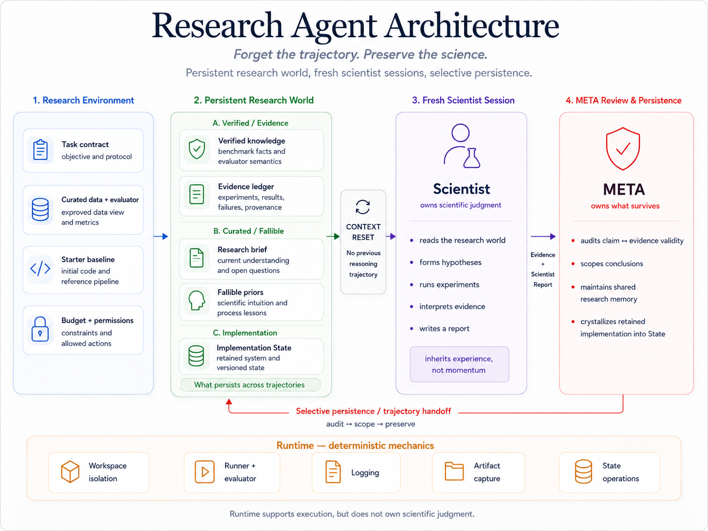
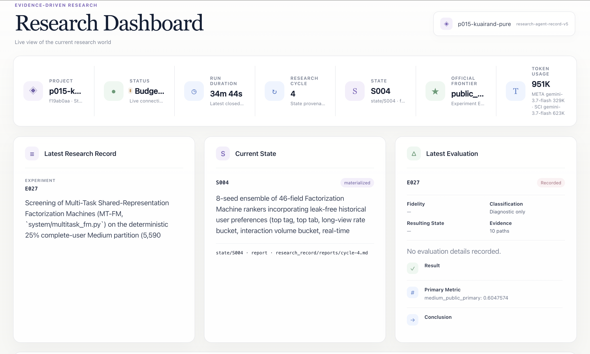
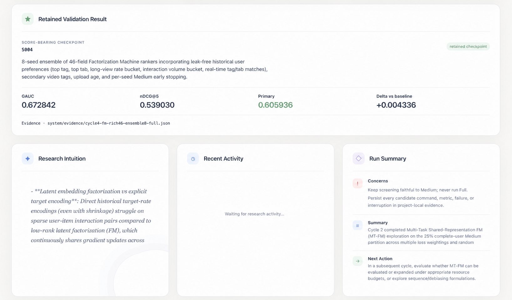
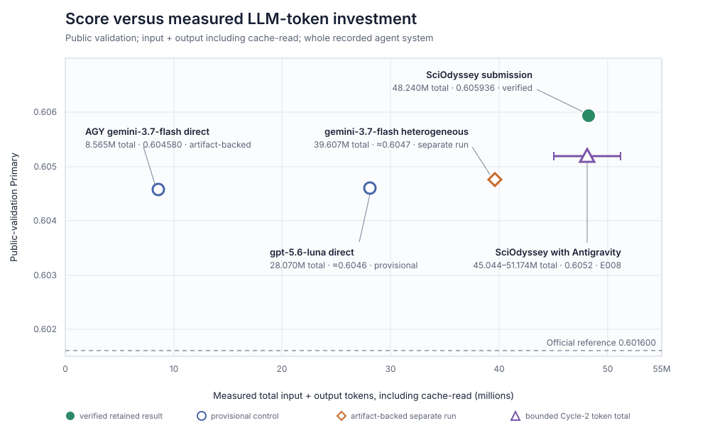

# Research Agent

## TikTok TechJam 2026 — Problem 2: Autonomous ML Research for Recommender Systems

> **Preserve the research world. Reset the researcher.**

Research Agent is a reusable agent Skill backed by a lightweight runtime framework for autonomous, evidence-driven machine-learning research. It separates a persistent research world from temporary Scientist reasoning trajectories so that verified progress, failed experiments, implementation state, and scientific intuition can survive without forcing every future Scientist to continue the same line of thought.

On the required KuaiRand-Pure benchmark, the Research Agent submission reached public-validation **GAUC 0.6728421**, **nDCG@5 0.5390304**, and **primary 0.6059363**. This is an absolute **+0.0043363 primary** improvement over the published validation reference. A separate post-freeze offline audit of the final test predictions produced hidden/test **GAUC 0.6669537**, **nDCG@5 0.5324907**, and **primary 0.5997222**. The submitted implementation is a CPU NumPy recommender scorer: it ranks candidate videos for each user and interaction context by combining 38 baseline demographic/video/context fields with 8 leakage-safe historical preference, affinity, match, tag, and video-age fields, then averaging eight Factorization Machines.

The canonical competition evidence is deliberately frozen at experiments E001–E013 and the final Research Agent submission. The Parallel/Synthesis episode is also described below as a trajectory example of how independent research worlds can be reviewed and handed to a fresh Scientist.

## Submission Snapshot

| Item | Verified value |
|---|---|
| Challenge | TikTok TechJam 2026, Problem 2 — Autonomous Machine Learning Research Agent for Recommender Systems |
| Required benchmark | KuaiRand-Pure |
| Final development checkpoint | Final Research Agent implementation, source commit `338afcfd433aad01b1af362155ea2a262c06791c` |
| Submitted agent | Research Agent |
| Submitted implementation | Eight-seed, 46-field Factorization Machine ensemble, rank $k=16$ |
| Public-validation result | GAUC **0.6728421**, nDCG@5 **0.5390304**, primary **0.6059363** |
| Hidden/test result (post-freeze offline audit) | GAUC **0.6669537**, nDCG@5 **0.5324907**, primary **0.5997222** |
| Published validation reference | GAUC 0.6674, nDCG@5 0.5357, primary 0.6016 |
| Published hidden-test FM reference | GAUC 0.6610, nDCG@5 0.5282, primary 0.5946 |
| Absolute delta | GAUC **+0.0054421**, nDCG@5 **+0.0033304**, primary **+0.0043363** |
| Hidden/test delta vs published FM reference | GAUC **+0.0059537**, nDCG@5 **+0.0042907**, primary **+0.0051222** |
| Convergence | Three consecutive Full evaluations without a primary improvement greater than $\varepsilon=0.002$ |
| Agent iterations | **4 autonomous cycles / 50-iteration cap**; 13 retained named experiments, including 7 Full evaluations |
| Manual scientific interventions after launch | **0** in the retained research record |
| Training/evaluation hardware | CPU NumPy; **0 GPU-hours** |
| Final implementation runtime | **764.74 seconds** |
| Retained E001–E013 agent runtime | **1h 55m 29s** across four cycle runs |
| Measured LLM tokens | **6,833,808** non-cache input + output across E001–E013; cache-read input reported separately |
| Development hidden-test access | None; hidden/test labels were not used for research, tuning, checkpoint selection, or convergence |
| Bonus benchmarks | Not attempted; no KuaiRand-1K or KuaiRand-27K bonus claim |
| Final submission CSV | **170,588 rows; Starter Kit checker passed** ([artifact and checksum](../submission/research-agent-kuairand/final/submit-check.txt)) |

### Evidence boundary

This report uses the immutable final implementation snapshot and E001–E013 record in
[`submission/research-agent-kuairand/`](../submission/research-agent-kuairand/) as its canonical
public source. The source research-world snapshot is also included in
[`competition_archive/kuairand-pure/research-worlds/research-agent-source/`](../competition_archive/kuairand-pure/research-worlds/research-agent-source/);
later local trajectories do not support the canonical score claim.

The public [`submission/research-agent-kuairand/`](../submission/research-agent-kuairand/) package exports the submitted implementation, descriptive State metadata, E001–E013 ledger and reports, raw evidence JSON, code diffs, sanitized run telemetry, pinned environment, final prediction file, and checker result. Raw datasets, caches, personal paths, and later local experiments are excluded.

---

## 1. The Problem and Why It Matters

The TechJam task asks for more than a strong recommender model. The system must autonomously reproduce the official baseline, inspect data, form hypotheses, modify code, train and evaluate candidates, recover from failures, reflect on evidence, and continue until the prescribed convergence boundary.

The scored artifact is the validation-best checkpoint at convergence, evaluated once on the hidden test set by the organizer. The process is also part of the product: judges assess how independently the agent drives the iteration loop, how it handles failures, whether its reasoning targets meaningful parts of the stack, and how much LLM and compute resource it consumes.

This creates a long-horizon systems problem. A capable coding model can perform one experiment, but an autonomous research run must preserve several different things across many experiments:

- evaluator and data-split facts;
- reproducible metrics and negative results;
- the current strongest implementation;
- unresolved scientific uncertainty;
- engineering knowledge about the environment;
- enough provenance to audit why a checkpoint was retained.

A single persistent agent remembers these facts, but also retains every temporary hypothesis, debugging detour, and commitment to its own previous choices. Over time, the current implementation can become the center of the search space even when a qualitatively different direction deserves attention. Restarting the agent removes that momentum but also discards useful scientific progress.

Research Agent addresses this tension by giving the researcher and the research world different lifetimes.

> **A Scientist should be cognitively fresh, but scientifically informed.**

### Intended users and impact

The immediate users are ML engineers and research teams running repeated model-development loops. The system aims to make those loops:

- **more autonomous**, by allowing the Scientist to choose hypotheses, implementations, and follow-up experiments;
- **more durable**, by storing progress outside any one model process or conversation;
- **more auditable**, by linking retained States to exact evidence and reports;
- **less path-dependent**, by handing the research world to fresh Scientist trajectories;
- **more practical**, by supporting bounded runs, recovery, CPU-only baselines, and heterogeneous coding-agent CLIs.

The KuaiRand trajectory is the concrete validation case. The reusable contribution is the persistence boundary: it can be applied to other ML tasks whose research loop produces code, metrics, failures, and evolving scientific judgment.

### Development stack

| Category | Used in this project |
|---|---|
| Agent framework | Research Agent with META, Scientist, Runtime, State, Serial, and optional Parallel execution |
| Reusable interface | Repository-level [`SKILL.md`](../SKILL.md), which exposes the research protocol to compatible coding agents |
| Agent interfaces | Heterogeneous retained run: `gemini-3.7-flash` served as META across all four cycles; Scientist used `gpt-5.6-sol` in cycle 1, `gemini-3.7-flash` in cycles 2 and 4, and `gpt-5.6-luna` in cycle 3. `gpt-5.6-luna` and `gemini-3.7-flash` were also used for separate controls |
| Training implementation | Python and NumPy; no GPU framework required by the final submitted recipe |
| Environment and tooling | Python 3.12.11, NumPy 2.5.2, `uv`, Git, isolated worktrees, structured JSON/YAML evidence, local read-only dashboard |
| Dataset | KuaiRand-Pure only; no external training data |
| Organizer assets | Starter Kit data loader, evaluator, baseline reference, and submission checker; `evaluate.py` is unchanged |
| External pretrained weights | None used by the submitted implementation |

---

## 2. Evaluation Protocol

### 2.1 Authoritative metric definition

Some older text in the released Problem Statement still mentions `NDCG@10 / Recall@50`. This submission follows the current Starter Kit, which is authoritative for the label, split, metrics, submission schema, and convergence rule:

- label: `long_view`;
- task: within-user ranking over logged impressions;
- metrics: GAUC and nDCG@5;
- primary: `mean(GAUC, nDCG@5)`;
- convergence: $\varepsilon=0.002$, $N=3$ consecutive Full evaluations;
- final ranking artifact: the validation-best checkpoint at convergence.

The organizer's `starter_kit/evaluate.py` was not modified.

### 2.2 Dataset boundary

| Split | Date range | Use |
|---|---|---|
| Train | 2022-04-08 to 2022-04-21 | Feature construction and model training |
| Public validation | 2022-04-22 to 2022-04-28 | Development feedback and final checkpoint selection |
| Hidden test | 2022-04-29 to 2022-05-08 | Organizer-only final scoring |

The retained Full validation set contains 124,909 rows and 22,377 users. The deterministic Medium screen contains 31,536 rows from 5,590 complete users and is used only for economical screening and per-seed checkpoint selection. Medium and Smoke results never increment or reset the Full convergence counter.

No hidden-test file or hidden label was used during development, model selection, or convergence. After the submitted implementation and its final prediction file were frozen, a separate offline audit evaluated the 2022-04-29 to 2022-05-08 rows from the complete released standard log with the unchanged Starter Kit evaluator. This audit is reported as a post-freeze hidden/test result and was not a development signal.

### 2.3 Official references

| Reference | Validation GAUC | Validation nDCG@5 | Validation primary | Purpose |
|---|---:|---:|---:|---|
| Random | 0.4993 | 0.4675 | 0.4834 | Evaluator sanity check |
| Item popularity | 0.6387 | 0.5227 | 0.5807 | Static control |
| Official five-field FM | **0.6674** | **0.5357** | **0.6016** | Competition reference to beat |

The published hidden-test FM reference is GAUC 0.6610, nDCG@5 0.5282, and primary 0.5946. The post-freeze audit scored **GAUC 0.6669537**, **nDCG@5 0.5324907**, and **primary 0.5997222**, exceeding that reference by **+0.0059537**, **+0.0042907**, and **+0.0051222**, respectively. This is an offline reconstruction using the released full log and the official evaluator, not a score returned by the organizer's private leaderboard.

### 2.4 Submission schema

The Starter Kit requires one row per evaluation example:

```csv
row_id,user_id,video_id,score
```

`row_id` must begin at zero and increase without gaps; `user_id` and `video_id` must match the evaluation split exactly; `score` must be finite. The final Research Agent output passed:

```bash
uv run --python 3.12.11 --with numpy==2.5.2 \
  python starter_kit/submit.py final/research-agent-test.csv \
  --data_dir /absolute/path/to/KuaiRand-Pure/data --split test --check
```

The checked [`research-agent-test.csv`](../submission/research-agent-kuairand/final/research-agent-test.csv) contains 170,588 prediction rows. The preserved [checker output and SHA-256](../submission/research-agent-kuairand/final/submit-check.txt) confirm schema and row alignment. Test labels were not used for development, checkpoint selection, or convergence; they were used only in the post-freeze offline audit reported above.

---

## 3. Solution: Persistent Research World, Fresh Scientist

Research Agent separates three responsibilities:

| Layer | Owns | Lifetime |
|---|---|---|
| **Scientist** | Scientific judgment, coding, experiments, interpretation | One research trajectory |
| **META** | Evidence audit, selective persistence, trajectory handoff, State crystallization | Across trajectories |
| **Runtime** | Process isolation, cancellation, runner configuration, deterministic invariants | System lifetime |

> **Scientist owns the science. META owns what survives. Runtime owns what must be deterministic.**



*Figure 1. Research Agent architecture and the boundary between scientific judgment, selective persistence, and deterministic execution.*

The same role and persistence contract is packaged in the repository-level [`SKILL.md`](../SKILL.md). This lets another compatible coding-agent session enter the protocol without embedding KuaiRand-specific logic in the Skill itself; KuaiRand-Pure is the end-to-end validation task, while the research-world abstraction remains reusable across projects.

### 3.1 Serial research loop

The Scientist is not a subagent executing a hypothesis chosen by META. It decides what scientific question matters, how to implement the experiment, how to interpret the result, and whether to continue or pivot. META maintains the world in which that independent reasoning happens.

### 3.2 Selective persistence

The research world separates information by the role it should play in future decisions:

| Information role | Durable artifacts |
|---|---|
| Evidence and provenance | experiment metrics, logs, code diffs, original Scientist reports |
| Verified/shared knowledge | evaluator facts, data facts, reusable engineering knowledge |
| Current research state | concise maintained brief and cumulative experiment ledger |
| Fallible priors | scientific intuition and process lessons |
| Reusable implementation | explicit State descriptor, Git tag, and `system/**` implementation |

This avoids compressing facts, interpretations, implementation state, and temporary reasoning into one undifferentiated conversation. The detailed ownership model is documented in [`ARCHITECTURE.md`](ARCHITECTURE.md).

### 3.3 State and recovery

A State captures a retained implementation and its evidence identity, not the entire chronology that produced it. A fresh process can reconstruct the current research world from disk, materialize the retained State, and continue without access to the previous Scientist's hidden conversation.

This changes the unit of durability from the agent process to the research world: when an agent process stops, State, evidence, and reports remain available for a new META or Scientist process to continue the research.

### 3.4 Parallel breadth

The same persistence boundary can seed multiple independent Scientist trajectories in isolated worktrees:

Branches do not share a live reasoning context while developing. Optional synthesis occurs only after review: one branch remains the implementation parent, while other completed branches contribute reference-only evidence to a fresh Scientist. Parallel is an available breadth operator; it is not claimed as the source of the final benchmark gain.

### 3.5 What is novel here

The contribution is not simply using multiple agents or storing a longer transcript. It is the separation of scientific authority from persistence authority:

| Design | What persists | Primary failure |
|---|---|---|
| One persistent agent | Facts and full reasoning trajectory | Increasing trajectory lock-in |
| Naive restart | Almost nothing | Relearned evaluator, repeated failures, lost progress |
| Conventional supervisor–subagent | Parent's plan and delegated results | Subagents extend the parent's framing |
| Tree search without shared memory | Independent branches and rewards | Scientific knowledge fragments across branches |
| **Research Agent** | Evidence, knowledge, State, and fallible priors; Scientist cognition resets | Compression and handoff quality remain open research questions |

The design principle is compact:

> **The new Scientist inherits the experience, not the momentum.**

Five related design choices make that principle operational:

1. **Reset at trajectory boundaries, not after every experiment.** A Scientist keeps enough continuity to run diagnostics and follow-ups inside one productive line of inquiry. A fresh Scientist is introduced when a research trajectory ends, so local scientific reasoning is not fragmented into isolated one-shot calls.
2. **Share evidence later than cognition.** Independent Parallel branches first develop without a shared live context. Optional synthesis exposes completed evidence only after branch review, reducing the risk that early sharing collapses diverse branches into the same framing.
3. **Use heterogeneous models as research priors.** META and Scientist can use different model and CLI configurations. This makes model-specific search behavior an allocatable resource rather than forcing one model to supervise and conduct every kind of reasoning.
4. **Fail fast on candidates, not on research.** Cheap Smoke and Medium screens reject weak implementations, while the broader research trajectory preserves the negative evidence and remains free to reframe the problem. A failed candidate is information, not an automatic convergence signal.
5. **Keep scientific workflow out of deterministic runtime.** Runtime enforces isolation, cancellation, provenance, and State integrity, but it does not impose a mandatory hypothesis or bottleneck state machine. New mechanisms are added in response to observed failures rather than encoded as speculative process complexity.

Together, these choices address a tension that ordinary persistence, naive restarts, and tree search each leave unresolved: sharing enough history to accumulate science can also recreate a common anchor. Research Agent shares an audited research world while deliberately declining to preserve one model's hidden continuation path.

---

## 4. End-to-End Autonomous KuaiRand Trajectory

### 4.1 Competition trajectory and evidence scope

The retained competition trajectory covers cycles 1–4 and experiments E001–E013. It begins with baseline reproduction, explores feature, model, loss, and ensemble alternatives, and ends at the final Research Agent implementation. Every Full result below uses the complete public-validation set and the unchanged organizer evaluator.

| Experiment | Scientific question | Evidence and decision |
|---|---|---|
| E001 | Can leakage-safe historical target encodings capture ranking signal cheaply? | Best Medium primary 0.5865; sparse target-encoding variants were rejected. |
| E002 | Does a richer categorical representation improve the organizer FM? | A 15-field FM reached Medium primary 0.6025 and was selected for Full verification. |
| E003 | Can the selected rich FM reproduce a valid starting checkpoint? | Full GAUC 0.6671070, nDCG@5 0.5361550, primary 0.6016310; established the initial recoverable implementation. |
| E004 | Does target encoding complement the rich FM? | Medium selected blend weight zero; Full result was identical to the initial 15-field implementation; blend rejected. |
| E005–E007 | Do wider representations or alternative architectures create a stronger base? | A 38-field FM improved the screen; CatBoost, DeepFM, multi-task prototypes, sparse crosses, and larger rank were weaker in the tested forms. |
| E008 | Does multi-seed ensembling make the 38-field gain robust? | Five-seed Full primary 0.6040901, +0.0024901 over reference; retained as the stronger ensemble baseline. |
| E009 | Does an eight-seed ensemble reduce optimization variance further? | Full primary 0.6044289; strengthened the ensemble baseline and incremented the no-large-improvement counter. |
| E010–E012 | Can dense preference features or field weighting improve the frontier? | A 46-field FM and FwFM were screened; four-seed FwFM reached Full primary 0.6054846 but did not clear the $\varepsilon$ threshold. |
| E013 | Does an eight-seed 46-field FM provide the strongest valid final checkpoint? | Full primary **0.6059363**; selected the submitted implementation and completed convergence 3/3. |

This is broader than parameter sweeping. The agent weakened an initially attractive target-encoding hypothesis, reproduced a valid baseline, rejected a non-complementary blend, tested alternative model families and loss formulations, expanded the representation with leak-free user-affinity features, and used multi-seed Full verification before retaining new States.

### 4.2 Concrete recovery event

During cycle 1, the combined FM command completed training and evaluation but failed while serializing evidence because organizer outputs backed by NumPy predictions contained `numpy.float32` values. The Scientist preserved the printed measurements, modified the evidence writer to convert NumPy scalars, and reran successfully. No human selected the repair or edited the code.

This event illustrates the robustness criterion directly: a failure occurred, the agent diagnosed it, repaired the implementation, reran the experiment, and retained auditable evidence rather than terminating the research run.

### 4.3 Final Research Agent implementation

The submitted implementation keeps the reliable pointwise logistic FM family and adds compact, leak-free historical preference and affinity signals:

- 38 demographic, context, and video fields from the stronger earlier representation;
- user top historical tag and recommendation tab;
- historical long-view-rate and interaction-volume buckets;
- candidate tag/tab match indicators;
- secondary video tag and upload-age features;
- eight independent seeds with deterministic Medium checkpoint selection.

| Implementation property | Submitted value |
|---|---|
| Implementation | Research Agent submission: eight Factorization Machines, seeds 0–7 |
| Rank and optimizer | $k=16$, learning rate 0.001, $l2=10^{-5}$ |
| Representation | 46 categorical fields, dimension 42,705 |
| Training data | 1,141,112 historical rows |
| Checkpoint selection | BLAKE2b deterministic 25% complete-user Medium slice |
| Full evaluation | 124,909 rows, 22,377 users |
| Full result | GAUC **0.6728421**, nDCG@5 **0.5390304**, primary **0.6059363** |
| Full model runtime | **764.74 seconds** |
| Post-freeze hidden/test audit | GAUC **0.6669537**, nDCG@5 **0.5324907**, primary **0.5997222** |

The public reproduction command is:

```bash
cd submission/research-agent-kuairand
uv run --python 3.12.11 --with numpy==2.5.2 \
  python system/ensemble_46.py \
  --data-dir /absolute/path/to/KuaiRand-Pure/data \
  --seeds 0 1 2 3 4 5 6 7 \
  --k 16 --lr 0.001 --l2 1e-5 --full \
  --submission final/research-agent-test.csv \
  --output final/research-agent-run.json
```

Canonical public evidence includes the [implementation descriptor](../submission/research-agent-kuairand/research_record/STATE.yaml), [E001–E013 ledger](../submission/research-agent-kuairand/research_record/RESEARCH_RECORD.yaml), [cycle reports](../submission/research-agent-kuairand/research_record/reports/), [transition patches](../submission/research-agent-kuairand/diffs/), [raw evidence](../submission/research-agent-kuairand/system/evidence/), and [final reproduction result](../submission/research-agent-kuairand/final/research-agent-run.json).

The read-only dashboard presents the retained result without allowing presentation-layer inspection to mutate the research world.



*Figure 2. Dashboard overview for the retained KuaiRand-Pure research world.*



*Figure 3. Submitted implementation validation result and evidence identity.*

---

## 5. Results and Controls

### 5.1 Validation frontier

| Checkpoint | GAUC | nDCG@5 | Primary | Primary delta vs 0.6016 | Decision |
|---|---:|---:|---:|---:|---|
| Published official validation reference | 0.6674000 | 0.5357000 | 0.6016000 | — | Reference |
| Initial 15-field rich FM | 0.6671070 | 0.5361550 | 0.6016310 | +0.0000310 | Valid reproduced starting implementation |
| Five-seed 38-field FM | 0.6704182 | 0.5377619 | 0.6040901 | +0.0024901 | First material improvement |
| Eight-seed 38-field FM | 0.6712176 | 0.5376403 | 0.6044289 | +0.0028289 | Stronger ensemble baseline |
| **Research Agent submitted implementation: eight-seed 46-field FM** | **0.6728421** | **0.5390304** | **0.6059363** | **+0.0043363** | **Validation-best final checkpoint** |

The submitted implementation improves both official component metrics rather than trading one against the other. It is selected from public validation only. The post-freeze offline hidden/test audit is reported separately and did not influence implementation selection or convergence.

### 5.2 Convergence

The convergence rule is based on improvements greater than $\varepsilon=0.002$ across consecutive Full evaluations. Medium and Smoke screens are neutral.

The five-seed 38-field FM improved over the initial rich FM by more than $\varepsilon$ and reset the counter. The eight-seed 38-field FM, the Full FwFM candidate, and the submitted implementation each improved the incumbent frontier by less than $\varepsilon$. The submitted implementation therefore completed the third consecutive Full evaluation without a large improvement, reaching convergence 3/3 while remaining the validation-best checkpoint.

### 5.3 Evidence-qualified agent-system comparison

The controls are strong optimizers rather than straw men. To compare unlike
runners without allowing cache behavior to dominate the resource axis, the
figure uses one explicit accounting convention: measured **non-cache input +
output tokens for the whole recorded agent system**. The official reference has
no agent-token cost and is shown as a horizontal score reference.



*Figure 4. Outcome versus measured LLM-token investment. Shape and fill qualify
the evidence; the plot is not a claim that all conditions used identical
protocols or that the score differences are statistically significant.*

| Agent system | Non-cache input + output | Best public-validation Primary | Delta vs 0.6016 | Evidence status | Main search direction |
|---|---:|---:|---:|---|---|
| **`gpt-5.6-luna` 3h direct Goal baseline** | **404,934** | **approximately 0.6046** | **approximately +0.0030** | Provisional; measured telemetry, report/README score, terminal closed after `task_complete` | Six-field FM, positive weighting, and `tab×hour` |
| Direct `gemini-3.7-flash` Goal | 1,361,547 | approximately 0.60447 | approximately +0.00287 | Provisional | Deep interactions, auxiliary task, EMA |
| `gemini-3.7-flash`-only Research Agent trajectory, through Cycle 2 | 2,070,960–2,898,630* | 0.6052 | +0.0036 | Artifact-backed; online-history semantics noted | Seed-42 item-sequence DIN |
| **Research Agent submitted implementation** | **6,833,808** | **0.6059363** | **+0.0043363** | **Verified retained result** | Multi-cycle representation and ensemble search |
| `gemini-3.7-flash` heterogeneous subagents | 7,726,649 | approximately 0.6047 | approximately +0.0031 | Artifact-backed separate run | Parallel heterogeneous architecture search |

\* The `gemini-3.7-flash`-only trajectory interval is not statistical uncertainty. It is an accounting bound:
2,070,960 tokens are directly attributable through Cycle 2; 2,898,630 assigns
the entire unsplittable Cycles 2–4 META aggregate to the Cycle-2 boundary.

For the `gpt-5.6-luna` 3h control, 404,934 is only the non-cache comparison
value. The raw usage total is **28,069,574 tokens**, including **27,664,640
cache-read tokens**; the raw input field is 27,999,762 and output is 69,812.

The `gpt-5.6-luna` 3h direct baseline is the lowest-token strong optimizer in this
comparison. The `gemini-3.7-flash`-only Research Agent trajectory reached `0.6052` by Cycle 2
with a bounded cumulative cost of 2.071M–2.899M measured tokens, while the submitted Research Agent implementation remains the
highest-scoring verified result. The delegated `gemini-3.7-flash` search used slightly more
measured non-cache tokens than the submitted implementation without surpassing its retained score. This
does **not** make the plot a token-efficiency frontier:
there is one recorded run per condition, model and launcher protocols differ,
and the direct controls retain unresolved audit qualifications.

The defensible quantitative statement is narrow. The submitted Research Agent implementation is approximately
`+0.00134` above the `gpt-5.6-luna` 3h direct baseline, `+0.0007363` above the
Cycle-2 `gemini-3.7-flash`-only trajectory score,
and approximately `+0.00124` above the heterogeneous-subagent
`gemini-3.7-flash` result on the
same public-validation Primary metric. The stronger system-level evidence is
that the submitted implementation connects its score to a reproducible implementation, an E001–E013 decision
ledger, raw evidence, an exact reproduction result, and a checked output file.
Complete control provenance is archived in
[`gpt-5.6-luna-3h-goal-baseline.md`](../competition_archive/kuairand-pure/reports/gpt-5.6-luna-3h-goal-baseline.md),
[`direct-gemini-3.7-flash-goal-baseline.md`](../competition_archive/kuairand-pure/reports/direct-gemini-3.7-flash-goal-baseline.md), and
[`gemini-3.7-flash-heterogeneous-subagents-baseline.md`](../competition_archive/kuairand-pure/reports/gemini-3.7-flash-heterogeneous-subagents-baseline.md).
The synthesis and claim boundaries are in
[`baseline-and-token-synthesis.md`](../competition_archive/kuairand-pure/reports/baseline-and-token-synthesis.md).
The implementation and protocol findings behind the provisional control labels
are consolidated in the [baseline protocol audit](../competition_archive/kuairand-pure/reports/baseline-protocol-audit.md).

### 5.4 What the baselines reveal about LLM research failure

The direct controls show that a capable coding agent can find a strong model.
They also expose why an improved metric is not by itself a reliable scientific
result. The independent audit found executable experiments whose mechanism
claims were not supported by their implementation: an allegedly within-user
pairwise loss did not enforce shared users; a target-statistics branch reused
training labels in its own features; and a pair sampler admitted a small number
of same-user, same-video conflicting-label pairs. Repeated selection on the
same public validation set further makes all reported scores search outcomes,
not independent generalization confirmation.

This motivates two failure classes relevant to the architecture:

1. **Scientific-validity failure.** Code runs and a plausible metric improves,
   but leakage, sample semantics, evaluator use, or artifact identity does not
   support the stated conclusion. META audits the experiment-level claim and
   evidence boundary; it is not a formal verifier and cannot guarantee that
   every implementation defect is detected.
2. **Trajectory failure.** A persistent LLM can produce increasingly elaborate
   local experiments while exploring an increasingly narrow neighborhood of
   the incumbent. Research Agent externalizes facts, negative evidence, and the
   best implementation, then gives a fresh Scientist room to challenge the
   inherited framing: **inherit the evidence, not the momentum**.

The underlying observations are preserved in
[`scientific-validity-failure.md`](../competition_archive/kuairand-pure/analysis/scientific-validity-failure.md),
[`late-stage-anchoring.md`](../competition_archive/kuairand-pure/analysis/late-stage-anchoring.md),
and
[`model-search-behavior.md`](../competition_archive/kuairand-pure/analysis/model-search-behavior.md).

The separate `gemini-3.7-flash`-only trajectory is a Research Agent run using
`gemini-3.7-flash` for both META and Scientist. This comparison freezes it at Cycle 2,
where E008
(`E008_din_dualseq`) trained one Seed-42 DIN and reached GAUC `0.6725`, nDCG@5
`0.5380`, and Primary `0.6052` at 2026-09-01 02:00:48 Singapore time—about 14
minutes after the resume began. The exact score, token interval, and protocol
qualification are recorded in the [Cycle-2 E008 evidence snapshot](../competition_archive/kuairand-pure/evidence/gemini-3.7-flash-only-cycle2-e008.md).

The Cycle-2 Scientist session recorded 802,865 non-cache input + output tokens.
Adding the complete Cycle-1 system cost gives a directly attributable cumulative
minimum of 2,070,960. The persistent META session spans Cycles 2–4 and exposes
only one 827,670-token aggregate, so it cannot be split exactly at the Cycle-2
boundary. Adding that entire META aggregate gives a conservative cumulative
upper bound of 2,898,630; Figure 4 therefore draws a horizontal token interval
rather than inventing a point estimate.

The previously noted validation-label concern needs a narrower interpretation.
The shared sequence builder does use earlier validation `is_click` and
`long_view` labels for engaged/negative-history facets, which affects dual or
engagement-sequence candidates. E008 uses only `facets=['vid']`, so its model
consumes prior validation video IDs, not those label-conditioned facets. E008 is
therefore **not directly invalidated by validation-label leakage**. Its remaining
protocol question is whether the organizer permits online use of earlier
validation impressions when scoring later rows; that assumption should be
stated explicitly rather than described as proven leakage.

### 5.5 A parallel search for a better ranker

One observation from the study is that the optional Parallel/Synthesis pattern
can turn independent search into a focused handoff. Starting from a fresh
research world, three independent `gemini-3.7-flash` Scientists explored
concurrently under `gpt-5.6-luna` review. The review selected one branch as the
implementation parent and used another as reference evidence for a fresh
synthesis Scientist.

In this observed trajectory, the selected line moved from a pointwise FM
control near 0.6015 to within-user pairwise BPR, a train-only video-tag field,
and a five-seed ensemble near 0.6048. The synthesis Scientist then used a
six-field BPR FM with `k=32`, five seeds, and within-user rank normalization,
reaching public-validation GAUC `0.6726716757`, nDCG@5 `0.5384355783`, and
primary **`0.6055536270`**.

This episode illustrates the intended rhythm: independent search first,
evidence review second, and a fresh Scientist's implementation after the
handoff. We present it as an observation of the research process; the
canonical competition frontier remains the E001–E013 sequence and the final
Research Agent submission. The narrative is in [A Parallel Search for a Better
Ranker: the Research Agent Trajectory](trajectories/parallel-synthesis.md),
with the structured execution record in
[`parallel-synthesis-record.json`](reports/parallel-synthesis-record.json).

---

## 6. Autonomy, Robustness, and Feasibility

### 6.1 Autonomy definition and count

For this report, a manual scientific intervention means a human action after launch that selects the next hypothesis, edits candidate code, repairs a failed experiment, chooses a checkpoint, or overrides the agent's scientific decision.

The retained research record declares:

```yaml
manual_interventions: []
```

Manual scientific interventions after launch: **0**.

Human actions before launch—providing the task, provisioning the allowed dataset, selecting the agent CLI, and defining the budget—are setup, not autonomous research decisions. The local dashboard and `step` command provide observability and pause boundaries without asking the human to choose the science.

### 6.2 Evidence robustness

Research Agent asks a question that ordinary execution success does not answer:
did the evaluation procedure and retained artifact actually support the
scientific claim?

META audits the boundary between an experiment that produced a number and a
finding that should enter shared research memory. It can reject confounded
measurements, preserve scoped negative results, and keep unverified code out of
a retained State without duplicating every line of the Scientist's work. This
is an evidence-governance layer, not a guarantee of line-by-line program
correctness; unresolved protocol findings remain explicitly provisional.

### 6.3 Resource accounting

The four retained Research Agent runs that produced cycles 1–4 and experiments E001–E013 recorded measured per-role model usage:

| Role | Non-cache input | Output | Cache-read input | Non-cache input + output |
|---|---:|---:|---:|---:|
| META | 2,268,236 | 106,267 | 19,093,706 | 2,374,503 |
| Scientist | 4,293,746 | 165,559 | 25,125,542 | 4,459,305 |
| **Total** | **6,561,982** | **271,826** | **44,219,248** | **6,833,808** |

To avoid ambiguity, both accounting views are retained:

- non-cache input + output: **6,833,808 tokens**;
- input + output including cache-read input: **51,053,056 tokens**;
- GPU training/evaluation: **0 GPU-hours**;
- combined agent-run wall clock across cycles 1–4: **1h 55m 29s**;
- final-implementation-producing cycle-4 agent run: **42m 52s**, terminal status `converged`, exit code 0;
- final eight-seed Full model runtime: **764.74 seconds**.

The retained Research Agent trajectory was heterogeneous. `gemini-3.7-flash` was the META runner in all
four cycles. Scientist used `gpt-5.6-sol` in cycle 1, `gemini-3.7-flash` in
cycles 2 and 4, and `gpt-5.6-luna` in cycle 3. The separate `gemini-3.7-flash`-only trajectory used
`gemini-3.7-flash` for both roles. Through the Cycle-2 comparison
boundary it recorded **802,865** Scientist tokens in Cycle 2 and a bounded
cumulative cost of **2,070,960–2,898,630** non-cache input + output tokens, as
explained in §5.4.

For the Problem 2 iteration accounting, the retained Research Agent run used
**4 autonomous META–Scientist cycles out of the 50-iteration hard cap**. Each
cycle was one bounded `step` iteration (`max_cycles: 1`); the 13 named records
E001–E013 are experiments within those cycles, not additional agent-loop
iterations. Seven of the 13 records were Full public-validation evaluations;
the remaining records were Medium screens or diagnostics. The run stopped at
the convergence rule, before either the 50-iteration or six-hour ceiling.

The separate `gpt-5.6-luna` 3h direct Goal baseline recorded **335,122** non-cache
input tokens and **69,812** output tokens, for **404,934** comparison tokens.
Its raw snapshot is **28,069,574** input-plus-output tokens because
**27,664,640** cache-read tokens are included in the input field and excluded
from the comparison axis. The run used about **1h 55m 17s** of its configured
three-hour budget before completing its substantive task; its score is
therefore labeled provisional and its terminal closure after `task_complete`
is documented in the archived
[`gpt-5.6-luna-3h-goal-baseline.md`](../competition_archive/kuairand-pure/reports/gpt-5.6-luna-3h-goal-baseline.md)
report.

For comparison, the separate post-canonical heterogeneous `gemini-3.7-flash` subagent run
recorded **2,274.269765 seconds (37m 54.27s)**. Its main-agent subtotal was
**997,376** reported tokens, while the 32 native subagents contributed
**6,729,273**, for **7,726,649** combined reported tokens. Combined
cache-read context was **31,880,628**, giving **39,607,277** tokens when added
to the combined reported total. It is a separate agent-system experiment and
is therefore excluded from the retained E001–E013 resource total.

The canonical retained run ids, in cycle order, are `8b61e63ff45045ebbd28ac75cfbfb797`, `c29e18119d2c4a62af97beeea1921eef`, `0cfba5632d3947859403e64171ed0340`, and `b53b3b2ffc574ad788f16caef003e3ed`. Sanitized lifecycle and measured usage files for all four runs are published under [`telemetry/`](../submission/research-agent-kuairand/telemetry/).

The final Research Agent implementation is practical on commodity CPU hardware and does not require a GPU. The public reproduction environment pins Python 3.12.11 and NumPy 2.5.2.

### 6.4 Team contributions

The team used broad, overlapping responsibilities so that architecture, modeling,
evaluation, and evidence remained connected throughout the project:

| Team member | Primary contribution |
|---|---|
| Member 1 | System direction, Research Agent architecture, competition framing, and integration |
| Member 2 | KuaiRand-Pure data workflow, Starter Kit contract checks, metric verification, and submission alignment |
| Member 3 | Feature/model/ensemble implementation support and experimental-evidence review |
| Member 4 | Reproducibility, research records, telemetry, documentation, dashboard materials, and submission packaging |

The division above concerns human development of the framework, benchmark setup,
verification, and presentation. It does not change the autonomy accounting for the
retained run: after launch, no team member selected the next scientific hypothesis,
edited candidate code, repaired an experiment, or chose the retained checkpoint.

---

## 7. Limitations and Future Work

### 7.1 Architecture-value evidence is still limited

The two single-agent controls are useful, but they are not enough to isolate every causal contribution of META, State, trajectory reset, and memory design. A stronger study would repeat each condition across several seeds, budgets, model families, and ML tasks.

### 7.2 Selective persistence can still anchor future research

META compresses reports and evidence into a maintained memory stack. A summary can omit useful context or overstate a conclusion. A mature shared memory may itself become an anchor even when Scientist sessions are fresh. This should be measured as an intervention rather than assumed solved.

### 7.3 Benchmark scope is intentionally narrow

KuaiRand-Pure determines the required primary score and was the only scored benchmark used here. KuaiRand-1K and KuaiRand-27K remain future work; this submission claims no bonus result.

### 7.4 Hidden-test reporting boundary

The final Research Agent prediction file was audited after implementation freeze with the unchanged Starter Kit evaluator on the complete released test window. The audit produced **GAUC 0.6669537**, **nDCG@5 0.5324907**, and **primary 0.5997222**. It was not used for development, tuning, implementation selection, or convergence. Because this is an offline reconstruction from released data rather than an organizer leaderboard response, any private organizer score remains authoritative if the two differ.

---

## 8. Deliverable Checklist

The public package maps the written description, code, iteration evidence, final output, and resource accounting required for Problem 2.

| Deliverable | Current status | Required next evidence |
|---|---|---|
| Written project description | **Complete** | Adapt the opening sections to the Devpost text fields |
| Public framework code | **Complete** | Use the public `research_agent` branch |
| Canonical Research Agent project snapshot | **Complete** | [`submission/research-agent-kuairand/`](../submission/research-agent-kuairand/) |
| Comprehensive README | **Complete** | Root README and package README include setup, reproduction, limitations, and evidence links |
| Run and iteration logs | **Complete** | Public E001–E013 ledger, code-diff references, reports, and recovery evidence |
| Manual intervention summary | **Complete** | `manual_interventions: []` with the definition used here |
| Final output/checkpoint | **Complete** | Final implementation metadata and 170,588-row test prediction artifact |
| Submission validation | **Complete** | Starter Kit `submit.py --check` passed; output and checksum are preserved |
| Iteration count | **Complete** | 4 autonomous cycles / 50-iteration cap; E001–E013 experiment ledger |
| Resource accounting | **Complete** | Four-cycle measured usage telemetry, environment pin, wall-clock, and GPU accounting |
| Team contributions | **Complete** | Broad four-member responsibilities are documented in §6.4 and can be copied into Devpost |

---

## 9. Conclusion

Research Agent treats autonomous ML research as a persistence problem as much as a code-generation problem.

A persistent agent can remember useful science while becoming anchored to its own trajectory. A naive restart restores independence but discards progress. Research Agent separates those lifetimes: evidence, knowledge, implementation State, and fallible scientific intuition persist; Scientist cognition remains temporary and retains authority over what to test next.

The KuaiRand-Pure run demonstrates that this design can support a complete autonomous research loop. The agent reproduced a valid baseline, explored multiple parts of the algorithmic stack, recovered from an execution error, preserved negative findings, converged under the Starter Kit rule, and delivered a public-validation primary **0.6059363**, an absolute **+0.0043363** over the official validation reference, with **zero post-launch manual scientific interventions** and **zero GPU-hours**. A separate post-freeze audit of the final test predictions yielded hidden/test primary **0.5997222**.

The strongest claim is not that one architecture eliminates all research bias. It is that long-running machine research can preserve scientific progress without requiring one reasoning trajectory to remain alive forever.

> **Preserve what the research learned. Reset the cognition that learned it.**

---

## References

- TikTok TechJam 2026: [official Devpost event page](https://tiktoktechjam2026.devpost.com/)
- KuaiRand: [official repository](https://github.com/chongminggao/KuaiRand) and [Zenodo record](https://zenodo.org/records/10439422)
- MLE-Bench: [arXiv:2410.07095](https://arxiv.org/abs/2410.07095)
- AIDE: [arXiv:2502.13138](https://arxiv.org/abs/2502.13138)
- AI Scientist-v2: [arXiv:2504.08066](https://arxiv.org/abs/2504.08066)
